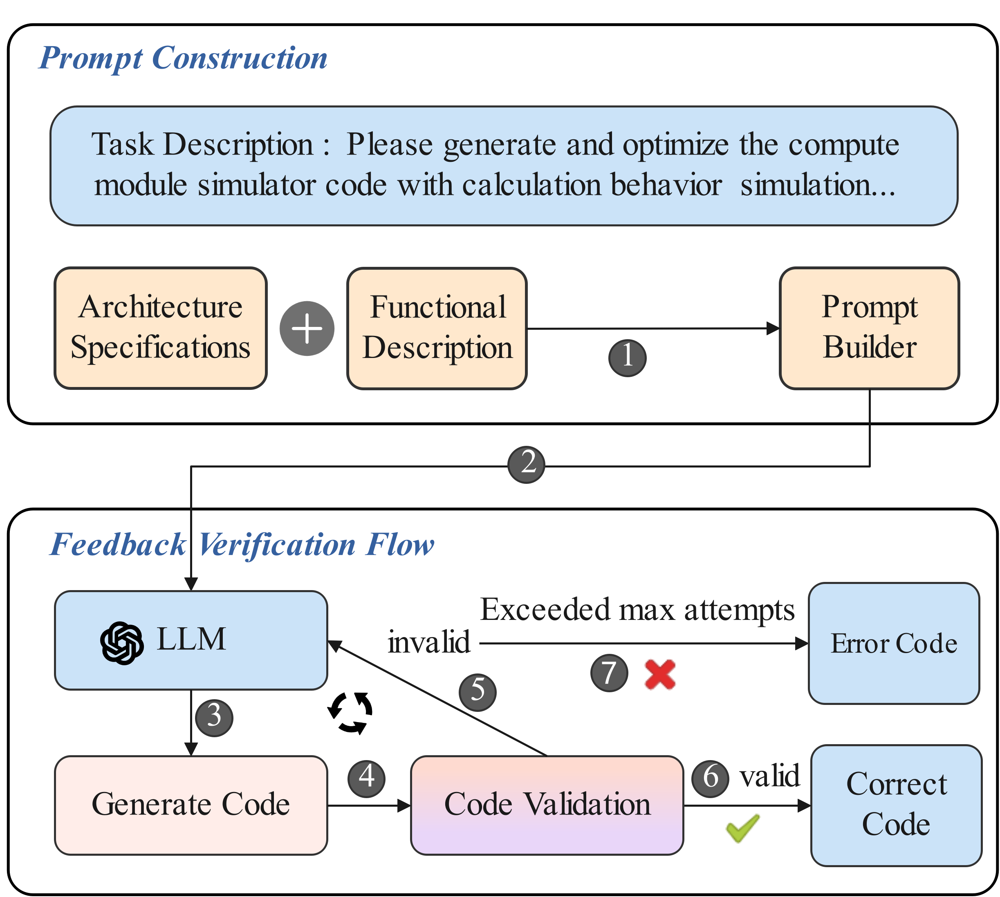
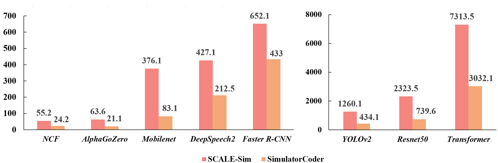

# SimulatorCoder: DNN Accelerator Simulator Code Generation and Optimization via Large Language Models.

This repository presents the implementation of ***\*SimulatorCoder\****, an agent powered by large language models (LLMs), designed to generate and optimize deep neural network (DNN) accelerator simulators based on natural language descriptions. By integrating domain-specific prompt engineering including In-Context Learning (ICL), Chain-of-Thought (CoT) reasoning, and a multi-round feedback-verification flow, SimulatorCoder systematically transforms high-level functional requirements into efficient, executable, and architecture-aligned simulator code.



## Dependency

Python 3.12.4

tqdm 4.67.1

absl-py 2.2.1

configparser 7.2.0

numpy 2.1.2

os, subprocess, math

## Usage

Example: 

```shell
python scale.py -t ./topologies/mlperf/Transformer.csv -c ./configs/scale.cfg >Transformer.txt
```

## Experimental  Results 



The implementation is inspired by https://github.com/ARM-software/SCALE-Sim.git.